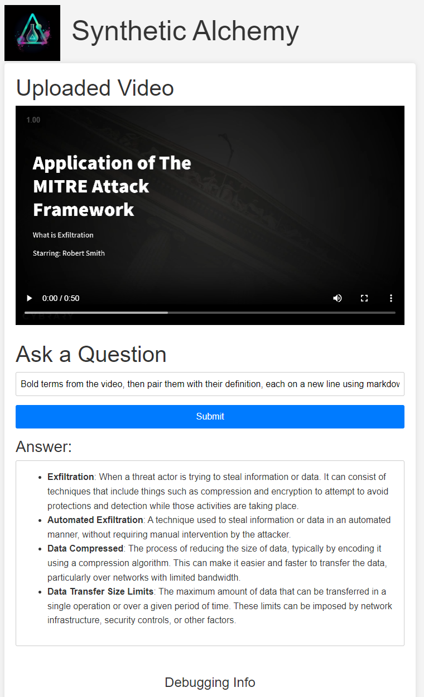

# SyntheticAlchemy - Video Q&A with AI
Have an AI watch and listen to a video so you can ask questions to it!

SyntheticAlchemy is a web application that allows users to upload a video and ask questions about its content. It utilizes OpenCV, pydub, and Google Cloud APIs for video processing, and OpenAI's GPT-3 for generating answers to the user's questions. The webapp has a `process_video` function that extracts frames and audio from the uploaded video performing image recognition and text detection using the Google Cloud Vision API. It transcribes the audio using the Google Cloud Speech-to-Text API. The function processes one frame at a time and compares the text data of each frame to avoid duplicates, it stores the unique text data and audio transcripts in separate lists to avoid overuse of tokens.

## Features

- Video content analysis using Google Cloud Speech-to-Text and Vision APIs
- Natural language processing for answering questions with OpenAI's GPT-3
- Simple web interface for video uploads and question submission

## Installation

1. Clone the repository:

`git clone https://github.com/0xdeadcell/SyntheticAlchemy.git`

2. Install the required packages:

`pip install -r requirements.txt`

3. Set up API keys:

- Sign up for an API key from OpenAI and replace `"your-openai-api-key"` in `app.py` with your actual API key.
- Set up a Google Cloud Platform (GCP) account and enable the Speech-to-Text API and Vision API. Download the JSON key for your service account and set the `GOOGLE_APPLICATION_CREDENTIALS` environment variable to the path of the JSON key file.

4. Setup Google Cloud to provide credentials:
- https://cloud.google.com/sdk/docs/install
- https://cloud.google.com/docs/authentication/provide-credentials-adc#how-to

## Usage

1. Start the Flask server:

`python app.py`

2. Open a web browser and visit `http://127.0.0.1:5000/` to access the application.

3. Upload a video in MP4 format, then ask questions about its content.

## Contributing

Pull requests are welcome. For major changes, please open an issue first to discuss what you would like to change.

## License

[MIT](https://choosealicense.com/licenses/mit/)
